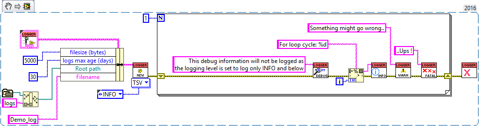

# Labview Logger Tools

#### 介绍
Simple logging utility with log levels - run in global scope.

#### 软件架构
有相当多的日志包-这个试图成为一个非常简单的变体，它不需要在整个应用程序中连接，而是使用FGV代替。它引入了几个日志级别，以便轻松控制日志信息的深度。

#### 安装教程

1.  xxxx
2.  xxxx
3.  xxxx

#### 使用说明
您所需要的就是在应用程序开始时初始化日志记录器。然后在应用程序的任何地方按特定级别进行日志记录。然后关闭记录器。

该代码段将产生以下内容 (application_directory/logs/[year]/[month]/[day]/Demo_log.tsv)

- 15:21:40.630 23.10.2018 INFO  For loop cycle: 0 Global_logger.lvlib:Example.vi
- 15:21:40.630 23.10.2018 WARN  Something might go wrong..  Global_logger.lvlib:Example.vi
- 15:21:40.630 23.10.2018 FATAL ..Ups ! Global_logger.lvlib:Example.vi

此外，您可以创建多个命名记录器，并为每个记录器分配一个输出目的地(文件或UI控件)。

#### 参与贡献

#### 特技

- Globally accessible logger
- Six logging levels
- Configurable level meaning:
    1. 这里是列表文本Standard: Ignores messages with log level which is less important that the logger's level.
    2. 这里是列表文本Positive: Ignores messages with log level with greater importance that the logger's level.
    3. 这里是列表文本Exact: Ignores messages with all levels except for the exact logger's level.
- Error wire check & error logging
Configurable record fields:
timestamp
log level
logger name
message
source VI
source app
Output to file
csv, tsv formats
year/month/day folder structure
configurable file size
configurable maximum logs age
Output to UI controls
String, Listbox, Multicolumn Listbox, Table controls
Option to write to multiple named loggers
Multiple outputs (file, UI) per logger each with it's own setup
Configurable record ordering: new records to top / bottom
Timestamp formatting
